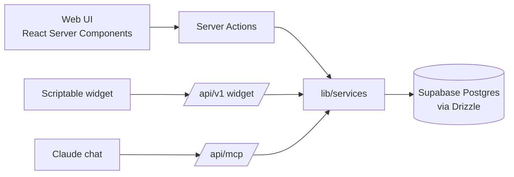
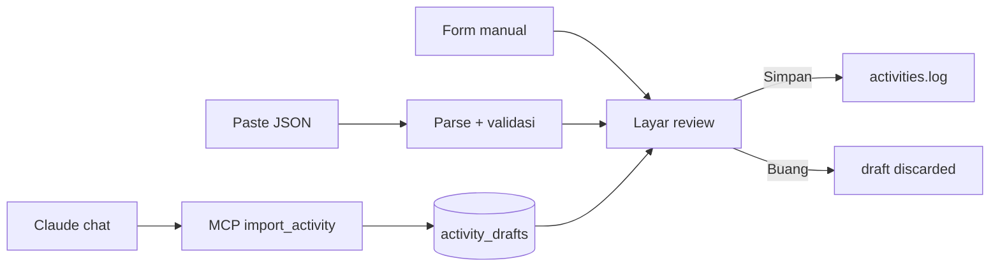

# Training App — Spec v1

Sep 25, 2026 · @Nadhif

## Cara pakai spec ini

Spec ini adalah sumber kebenaran untuk seluruh build. Export sebagai Markdown, lalu taruh di repo sebagai `docs/spec.md`; bagian **CLAUDE.md draft** disalin ke `CLAUDE.md` di root repo.

| Tempat | Dipakai untuk | Yang diberikan |
| --- | --- | --- |
| Claude chat | Keputusan produk, revisi spec, coaching | Spec ini |
| Claude Design | Design system dan layar (M1 paralel) | Bagian Overview, Screens & flows, contoh data asli |
| Claude Code | Semua kode, satu milestone per sesi | `CLAUDE.md` + `docs/spec.md`, lalu prompt per milestone |

Cara mulai tiap milestone di Claude Code: minta Claude Code membaca `docs/spec.md`, membuat rencana untuk milestone itu saja, tunggu kamu setujui, baru eksekusi. Setelah selesai, cek acceptance criteria di bagian Milestones.

Kalau ada keputusan yang berubah saat build, update spec ini dulu, baru kodenya.

## Overview

Web app personal untuk merencanakan dan mencatat latihan multi-sport (lari, strength, HIIT, sepeda, renang), dengan widget iPhone via Scriptable. Menggantikan workspace Notion sebagai sumber data, dan bisa dipakai teman-teman dengan data yang sepenuhnya terpisah per user.

**Tujuan v1**

- Nadhif bisa pindah total dari Notion: plan, log, race, dan alur coaching lewat Claude chat
- Teman bisa daftar, bikin plan, dan log latihan tanpa bantuan
- Today dan progress mingguan terlihat di home screen iPhone

**Prinsip produk**

1. **Form adalah jalur utama.** JSON dan MCP hanya mengisi form. Tidak ada data yang masuk ke tabel utama tanpa layar review dan tombol Simpan.
2. **Semua data personal.** Setiap baris punya `user_id`, tidak ada fitur berbagi atau tabel bersama.
3. **Kalender satu, program banyak.** Sesi disimpan per tanggal; Today dan This Week selalu query berdasarkan tanggal.
4. **Riwayat tidak ditimpa.** Zona HR dan metrik atlet disimpan sebagai riwayat, dan di-snapshot ke setiap aktivitas.
5. **Logika penting di backend.** Perhitungan (PR, progress, ringkasan mingguan) ada di satu service layer backend supaya web, widget, dan MCP selalu dapat angka yang sama.

## Keputusan & scope

| Area | Keputusan |
| --- | --- |
| Stack | Next.js (App Router, TypeScript) satu repo + Supabase (Postgres, Auth, Storage) + Vercel; Drizzle ORM, tanpa SQL function/view |
| Login | Google OAuth via Supabase Auth, signup terbuka, RLS per user |
| Input | Form utama; JSON paste dan MCP mengisi form lewat review |
| Program | 1 program utama aktif + beberapa program pendukung; sesi per tanggal |
| Struktur sesi | Session → Block (opsional rounds) → Item, semua kolom item opsional |
| Log latihan | Per set; default sesuai plan, edit yang meleset |
| Metrik atlet | Tabel riwayat + snapshot zona di tiap aktivitas |
| Sport non-lari | `run_metrics` terpisah; sport lain pakai `extra_metrics` JSONB |
| MCP | Import draft untuk semua user, OAuth |
| Widget | Scriptable, endpoint dengan token per user |

| Fitur | v1 | v2 |
| --- | --- | --- |
| Login Google, profil (zona, timezone, satuan) | ✓ |  |
| Today & This Week gabungan semua program | ✓ |  |
| Program utama/pendukung + fase | ✓ |  |
| Plan editor: tambah, edit, geser, duplikasi sesi/minggu | ✓ |  |
| Log aktivitas: form + review, per set untuk strength/HIIT | ✓ |  |
| JSON import (isi form) & export | ✓ |  |
| Races pribadi + Best Efforts otomatis | ✓ |  |
| Riwayat metrik atlet | ✓ |  |
| Widget Scriptable (Today + progress mingguan) | ✓ |  |
| MCP draft import untuk semua user + halaman panduan connect | ✓ |  |
| Export data & hapus akun | ✓ |  |
| Tabel `daily_notes` (tanpa UI) | ✓ | UI |
| Template sesi |  | ✓ |
| Import pengganti minggu dengan perbandingan sebelum/sesudah |  | ✓ |
| Ekstraksi screenshot di app (Claude API, berkuota) |  | ✓ |
| Chart tren (pace, HR, cadence, volume) |  | ✓ |
| Tools MCP coaching (adjust plan, coach notes) |  | ✓ |
| Template Claude Project untuk teman |  | ✓ |
| Peringatan dua sesi berat di hari sama |  | ✓ |

Di luar scope: fitur sosial/berbagi, sync Strava, native iOS app.

## Arsitektur & struktur repo

Satu app Next.js yang juga menjadi backend; Supabase dipakai untuk Postgres, Auth, dan Storage. Semua akses data lewat service layer, jadi UI, server actions, route API, dan MCP memanggil fungsi yang sama.



```
/app
  (auth)/login
  (app)/today
  (app)/week/[date]
  (app)/programs, programs/[id], programs/[id]/edit
  (app)/log/new, log/review/[draftId], log/[activityId]
  (app)/activities
  (app)/races
  (app)/settings  (profil, zona, token widget, connect Claude, export, hapus akun)
  api/v1/today, api/v1/week  (widget, token)
  api/mcp                    (MCP server, OAuth)
/lib
  services/   satu file per domain: programs, sessions, activities, drafts, races, profile
  schemas/    Zod: plan-import, activity-import, forms
  supabase/   client untuk Auth & Storage saja
  utils/      pace, durasi, tanggal & timezone
/db
  schema.ts    Drizzle schema (tabel, enum, constraint)
  client.ts    koneksi Postgres
  migrations/  hasil drizzle-kit, termasuk RLS deny-all
  seed.ts      data contoh untuk dev
/scripts
  migrate-notion/  script sekali jalan
/widget
  today.js     script Scriptable
/docs
  spec.md
```

**Aturan teknis**

- Komponen tidak pernah memanggil Supabase langsung; selalu lewat `lib/services`.
- Semua input divalidasi Zod di batas sistem (form, JSON import, MCP, API).
- Types diturunkan dari schema Drizzle, jangan ditulis manual.
- Angka disimpan dalam satuan dasar: detik, meter/km, kg. Format tampilan hanya di UI.
- Tanggal sesi disimpan sebagai `date` lokal user; timestamp sebagai `timestamptz`.

## Model data

Semua tabel punya `id uuid`, `user_id uuid not null` (FK ke `auth.users`, on delete cascade), `created_at`, `updated_at`, kecuali disebut lain. Tabel anak tetap menyimpan `user_id` supaya RLS sederhana.

**Enum**

| Enum | Nilai |
| --- | --- |
| `sport` | run, strength, hiit, cycling, swim, mobility, walk, rest, other |
| `session_type` | easy, long, tempo, interval, recovery, race, strength, hiit, mobility, cross, rest, other |
| `program_type` | main, supporting |
| `program_status` | draft, active, completed, archived |
| `session_status` | planned, done, skipped, modified |
| `set_status` | done, partial, failed, skipped |
| `feel` | great, good, okay, tough, bad |
| `source` | manual, json, mcp, notion |
| `draft_status` | pending, saved, discarded |
| `race_status` | planned, done, dns, dnf |

**Profil & metrik**

| Tabel | Kolom |
| --- | --- |
| `profiles` | `user_id` (PK), display\_name, timezone (default Asia/Jakarta), units (metric/imperial), week\_start (default monday), widget\_token\_hash |
| `athlete_metrics_history` | effective\_from (date), max\_hr, resting\_hr, lthr, hr\_zones (jsonb: z1–z5 min/max bpm), vo2max, target\_cadence\_spm, notes. Unique (user\_id, effective\_from) |
| `daily_notes` | date, condition (normal/sick/injured/fatigued/other), notes. Unique (user\_id, date) |

**Plan**

| Tabel | Kolom |
| --- | --- |
| `programs` | name, type, status, goal, start\_date, end\_date, goal\_race\_id (nullable), notes. Partial unique index: maksimal 1 program `main` berstatus `active` per user |
| `program_phases` | program\_id, name (Recovery/Base/Build/Peak/Taper/bebas), start\_date, end\_date, focus |
| `week_notes` | week\_start (date, minggu kalender), context, principles (text\[\]). Unique (user\_id, week\_start) |
| `planned_sessions` | date, program\_id (nullable), position, sport, session\_type, title, description, target\_duration\_min\_sec, target\_duration\_max\_sec, target\_distance\_m, target\_intensity (teks bebas: "Z1–Z2", "RPE 7"), status, status\_note, activity\_id (nullable), race\_id (nullable) |
| `planned_blocks` | session\_id, position, name, rounds (default 1), notes |
| `planned_items` | block\_id, position, name, sets, reps, duration\_sec, distance\_m, load\_kg, rest\_sec, target, notes. Semua opsional kecuali name |

**Log**

| Tabel | Kolom |
| --- | --- |
| `activities` | date, started\_at (nullable), sport, session\_type, title, duration\_sec, distance\_m, avg\_hr, max\_hr, calories, training\_load, rpe (1–10), feel, notes, coach\_notes, source, planned\_session\_id (nullable), effort\_distance\_m (nullable, menandai upaya PR di jarak standar), zone\_snapshot (jsonb), extra\_metrics (jsonb), screenshot\_paths (text\[\]) |
| `run_metrics` | `activity_id` (PK), avg\_pace\_sec\_per\_km, cadence\_spm, stride\_length\_m, gct\_avg\_ms, gct\_min\_ms, balance\_left\_pct, balance\_right\_pct, vo2max, elevation\_gain\_m |
| `activity_items` | activity\_id, planned\_item\_id (nullable), block\_name, position, name, notes |
| `activity_sets` | item\_id, set\_number, reps, duration\_sec, distance\_m, load\_kg, status, notes |
| `activity_drafts` | source, payload (jsonb mentah), status, activity\_id (nullable), expires\_at (default +14 hari) |

**Race**

| Tabel | Kolom |
| --- | --- |
| `races` | name, date, location, distance\_m, distance\_label (5K/10K/HM/FM/lain), status, target\_time\_sec, strategy, chip\_time\_sec, watch\_time\_sec, rank\_overall, total\_overall, rank\_gender, total\_gender, rank\_category, total\_category, report (markdown), activity\_id (nullable) |

Sesi yang sudah punya `activity_id` terkunci dari penghapusan dan dari import yang mengganti minggu.

## Logika backend & akses data

Semua logika ada di service layer Next.js (`lib/services`); database hanya menyimpan data. Tidak ada SQL function, view, atau trigger di Supabase.

**Akses data.** Server terhubung langsung ke Postgres Supabase lewat Drizzle ORM (schema di `db/schema.ts`, migration dari drizzle-kit). Alasannya: penulisan multi-tabel (misal log aktivitas ke 4 tabel) butuh transaksi, dan supabase-js tidak punya transaksi tanpa SQL function. Supabase tetap dipakai untuk Postgres, Auth (Google), dan Storage.

**Otorisasi.** Koneksi langsung tidak melewati RLS, jadi keamanan data ada di service layer: setiap fungsi service menerima `userId` dari sesi (web), token OAuth (MCP), atau token widget, dan setiap query wajib difilter dengan `user_id` itu. RLS tetap diaktifkan di semua tabel tanpa policy untuk client (deny-all), sebagai pengaman kalau ada akses dari browser.

**Constraint tetap di database** (bukan logika, tapi penjaga integritas): foreign key, unique, check (misal RPE 1–10), dan partial unique index satu program main aktif per user.

| Service | Fungsi |
| --- | --- |
| `activities.log(userId, input)` | Satu transaksi: insert `activities` (+ `run_metrics`, `activity_items`, `activity_sets`), isi `zone_snapshot` dari metrik yang berlaku, tautkan dan tandai `planned_session` done/modified, tandai draft saved. Validasi rentang wajar (pace, HR, RPE) |
| `sessions.mark(userId, sessionId, status, note)` | Ubah status sesi tanpa aktivitas |
| `plans.applyImport(userId, input, mode)` | Mode `add`: insert sesi baru. Mode `replace_week` (v2): ganti sesi yang belum dilog di rentang tanggal. Dalam transaksi |
| `plans.duplicateWeek(userId, from, to)` | Salin sesi + block + item, status kembali ke planned |
| `programs.activate(userId, programId)` | Tolak kalau sudah ada program main aktif lain |
| `programs.weekNumber(program, date)` | Nomor minggu program dari `start_date` |
| `metrics.at(userId, date)` | Metrik atlet yang berlaku pada tanggal itu |
| `stats.daySessions(userId, from, to)` | Sesi per tanggal + nama program, fase, aktivitas tertaut |
| `stats.weeklySummary(userId, weekStart)` | Km lari, total durasi, sesi selesai vs rencana, rata-rata RPE |
| `stats.bestEfforts(userId)` | PR per jarak standar dari `races` (chip) dan `activities.effort_distance_m`, dengan label sumber |
| `stats.sessionCompliance(userId, sessionId)` | Persen set sesuai plan, jumlah set failed |
| `drafts.listPending(userId)` | Hanya draft dengan `expires_at` di masa depan |
| `account.delete(userId)` | Hapus semua data user + file storage |

Draft kedaluwarsa dibersihkan oleh Vercel Cron harian yang memanggil service; sebelum itu, draft kedaluwarsa sudah tidak tampil karena difilter saat dibaca.

## Format JSON

Dua format, keduanya punya `schema` dan `version`, didefinisikan sekali di `lib/schemas` sebagai Zod dan dipakai untuk validasi, untuk teks tombol "Copy prompt", dan untuk MCP. Aturan parsing: app mencari blok JSON pertama di teks yang di-paste (boleh ada teks lain di sekitarnya), kolom tak dikenal diabaikan, kolom yang gagal validasi dikosongkan dan ditandai di form.

**Plan import** (`schema: "plan"`)

```json
{
  "schema": "plan",
  "version": 1,
  "program": { "name": "FM 2027 Base", "type": "main" },
  "week_notes": [
    { "week_start": "2026-10-05", "context": "Minggu pertama base", "principles": ["Semua run Z1-Z2"] }
  ],
  "sessions": [
    {
      "date": "2026-10-06",
      "sport": "run",
      "session_type": "easy",
      "title": "Easy Run",
      "target_duration_min": 30,
      "target_duration_max": 35,
      "target_intensity": "Z1-Z2",
      "blocks": [
        { "name": "Main", "items": [ { "name": "Easy jog", "duration_sec": 1800, "target": "HR 139-154" } ] },
        { "name": "Strides", "items": [ { "name": "Strides", "sets": 4, "distance_m": 80, "rest_sec": 60 } ] }
      ]
    },
    {
      "date": "2026-10-07",
      "sport": "strength",
      "title": "Hip & Core",
      "blocks": [
        { "name": "Circuit", "rounds": 3, "items": [
          { "name": "Glute bridge", "reps": 15 },
          { "name": "Band lateral walk", "reps": 12, "notes": "per sisi" },
          { "name": "Plank", "duration_sec": 45 }
        ] }
      ]
    }
  ]
}
```

`program` opsional (tanpa itu, sesi masuk sebagai sesi lepas atau ke program yang dipilih di layar import). Durasi target di level sesi dalam menit; di level item dalam detik.

**Activity import** (`schema: "activity"`)

```json
{
  "schema": "activity",
  "version": 1,
  "date": "2026-09-20",
  "start_time": "05:00",
  "sport": "run",
  "title": "HM Bandung",
  "duration": "2:58:27",
  "distance_km": 21.4,
  "avg_hr": 158,
  "max_hr": 181,
  "calories": 1650,
  "training_load": 310,
  "run": {
    "avg_pace": "8:19",
    "cadence_spm": 176,
    "gct_avg_ms": 290,
    "gct_min_ms": 250,
    "balance": "49.5/50.5",
    "vo2max": 38
  },
  "items": [
    { "name": "Pull-up", "sets": [ { "reps": 6 }, { "reps": 6 }, { "reps": 4, "status": "failed" } ] }
  ],
  "notes": ""
}
```

Format ini sengaja pakai bentuk yang mudah dibaca AI dan manusia (`"2:58:27"`, `"8:19"`); konversi ke detik dilakukan app. RPE dan Feel sengaja tidak ada: selalu diisi user di layar review. Angka di contoh adalah ilustrasi.

**Export** memakai format plan yang sama untuk rentang tanggal yang dipilih, jadi hasil export bisa langsung di-import kembali.

## Layar & alur

Mobile-first (dipakai di iPhone habis latihan), tetap nyaman di laptop untuk edit plan.

| Layar | Isi utama | Aksi |
| --- | --- | --- |
| Login | Tombol Google | Masuk, onboarding pertama kali: timezone, satuan, zona HR |
| Today | Sesi hari ini (semua program), target, block/item; badge draft pending | Mulai log, tandai skip, buka draft |
| This Week | 7 hari kalender, rencana vs aktual per hari, week\_notes, progress | Navigasi minggu, buka sesi, duplikasi minggu |
| Programs | Daftar program (main/pendukung, status) | Buat, aktifkan, arsipkan |
| Plan editor | Tampilan minggu dari program; edit sesi → block → item | Tambah/hapus/geser/duplikasi, import JSON (advanced), export JSON |
| Log baru | Pilih jalur: manual, paste JSON, atau buka draft | Semua menuju layar review |
| Review | Form lengkap sesuai sport; field dari AI ditandai; set per item terisi dari plan | Edit, isi RPE & Feel, pilih sesi plan yang cocok, Simpan / Buang |
| Activities | List aktivitas, filter sport | Buka detail |
| Detail aktivitas | Metrik, rencana vs aktual per set, zona saat itu | Edit, hapus |
| Races | Race mendatang & selesai, Best Efforts | Tambah race, tautkan aktivitas |
| Settings | Profil, riwayat metrik atlet, token widget, connect Claude, export, hapus akun | Tambah metrik baru, generate ulang token |



**Detail layar review**

- Untuk sport run: field ringkasan + `run_metrics`. Untuk strength/HIIT: daftar item dengan set, default terisi dari plan, tombol "Selesai semua", tap set untuk ubah reps/durasi/beban dan status.
- Deteksi kemungkinan duplikat: aktivitas lain di tanggal sama dengan sport sama dan jarak/durasi selisih kurang dari 5%.
- Saran sesi plan: sesi hari itu dengan sport sama, dipilih otomatis kalau hanya ada satu.

## MCP server & widget API

**MCP server** di `/api/mcp` (Streamable HTTP, TypeScript MCP SDK). Setiap request membawa access token OAuth user; service layer memverifikasi token dan menjalankan setiap query dengan user\_id pemiliknya.

| Tool | Input | Output |
| --- | --- | --- |
| `get_logging_context` | `date` (opsional, default hari ini di timezone user) | Sesi terencana hari itu (dengan block/item), 5 aktivitas terakhir, zona HR yang berlaku |
| `import_activity` | Objek sesuai schema `activity` | ID draft + link ke layar review. Tidak pernah menulis ke `activities` |

Deskripsi tool harus menjelaskan bahwa hasilnya draft yang perlu dicek user di app, dan bahwa RPE/Feel diisi user di app.

**OAuth untuk connector.** Target: Supabase Auth sebagai OAuth authorization server untuk MCP (discovery metadata, dynamic client registration, PKCE). Verifikasi dukungan ini di awal M4; kalau belum memadai, pakai library OAuth provider terpisah di Next.js yang tetap memakai Supabase untuk identitas user.

**Widget API**

| Endpoint | Isi |
| --- | --- |
| `GET /api/v1/today` | Tanggal, sesi hari ini (judul, sport, target, status), jumlah draft pending |
| `GET /api/v1/week` | Progress minggu ini (selesai/rencana, km lari), race berikutnya + hari tersisa |

- Auth: header `Authorization: Bearer <widget token>`. Token digenerate di Settings, ditampilkan sekali, yang disimpan hanya hash-nya. Bisa di-regenerate (token lama langsung mati).
- Endpoint memakai service layer yang sama; query selalu difilter ke `user_id` pemilik token.
- Rate limit sederhana per token; respons di-cache singkat (misal 5 menit).
- `widget/today.js`: script Scriptable untuk ukuran small, medium, dan lock screen rectangular; token disimpan di Keychain Scriptable.

## Migrasi dari Notion

Script sekali jalan di `scripts/migrate-notion`, memakai Notion API dengan integration token milik Nadhif. Idempoten: setiap baris menyimpan ID halaman Notion asal (kolom `extra_metrics.notion_id` atau tabel mapping sementara) supaya bisa dijalankan ulang tanpa duplikat. Selalu jalankan dulu dengan `--dry-run` yang mencetak ringkasan dan baris bermasalah.

| Sumber Notion | Tujuan | Transformasi |
| --- | --- | --- |
| Run Log (data source `6c0c1e89…`) | `activities` + `run_metrics`, source = notion | Duration `h:mm:ss` → detik; Avg Pace `8'19"` / `8:19` → detik/km; Balance L/R → dua angka; Distance km → meter; Run Type → `session_type`; Feel → enum |
| Run Log: Training Block (HM1, HM2) + Week # | `programs` (HM1, HM2 berstatus completed) | Tanggal mulai program dari aktivitas pertama yang punya Week # 1 |
| Halaman This Week (archive W6–W16 + W1 Recovery) | `planned_sessions` + `week_notes` | Parse tabel Hari / Rencana / Aktual / Catatan. ✅ di Aktual → done, tautkan ke aktivitas di tanggal sama. Baris yang gagal di-parse masuk laporan untuk dicek manual |
| Homepage: Next Races | `races` | Chip time, ranking, strategi ke kolom masing-masing |
| Homepage: Current Status | `athlete_metrics_history` | Z2 139–154 bpm, VO2Max 38, target cadence, dengan effective\_from = tanggal migrasi |
| Race Report HM Bandung | `races.report` | Markdown apa adanya |
| Coach Notes & Diskusi | Tidak dimigrasi di v1 | Tetap di Notion sebagai arsip sampai tabel coach notes ada di v2 |

Best Efforts di homepage tidak dimigrasi langsung; hasil `stats.bestEfforts` dicocokkan dengan tabel Notion sebagai uji kebenaran migrasi. PR 10K (1:22:00, Mei 2026) yang bukan dari race perlu aktivitasnya ditandai `effort_distance_m = 10000`.

Selama M0–M3, Notion tetap sumber utama. Sebelum cut-over di M4: jalankan migrasi ulang untuk menangkap data terbaru, cocokkan jumlah baris, lalu Notion dijadikan read-only.

## Milestone & acceptance criteria

Satu milestone = satu atau beberapa sesi Claude Code. Jangan mulai milestone berikutnya sebelum semua kriteria tercentang.

**M0 — Fondasi**

- [ ] Repo Next.js + TypeScript + lint + formatter, deploy kosong ke Vercel
- [ ] Project Supabase (dev + prod), Drizzle terhubung ke Postgres Supabase, migrations jalan
- [ ] Google OAuth jalan, halaman login dan onboarding dasar (timezone, satuan)
- [ ] `CLAUDE.md` dan `docs/spec.md` ada di repo

**M1 — Data & migrasi** (paralel: design di Claude Design)

- [ ] Semua tabel, enum, constraint, dan RLS deny-all sesuai spec, sebagai migration files
- [ ] Test kepemilikan: user A tidak bisa membaca atau menulis data user B lewat service mana pun
- [ ] `activities.log` berjalan dalam satu transaksi, menolak data di luar rentang wajar, dan mengisi `zone_snapshot`
- [ ] Script migrasi `--dry-run` bersih; migrasi nyata cocok dengan jumlah baris Run Log
- [ ] `stats.bestEfforts` menghasilkan 5K 32:06 dan HM 2:57:04 (chip)

**M2 — Web app inti**

- [ ] Today, This Week, Programs, Plan editor (tambah, edit, geser, duplikasi)
- [ ] Log manual → review → simpan, untuk run dan strength (per set)
- [ ] Aturan satu program main aktif ditegakkan di UI dan DB
- [ ] Nyaman dipakai di layar iPhone

**M3 — Import, race, widget**

- [ ] JSON import plan (mode add) dan activity, dengan tombol Copy prompt
- [ ] Export plan yang bisa di-import ulang tanpa perubahan
- [ ] Races + Best Efforts
- [ ] Widget API + `widget/today.js` tampil di home screen Nadhif

**M4 — MCP & cut-over**

- [ ] OAuth connector terverifikasi; connector bisa ditambahkan di Claude
- [ ] `get_logging_context` dan `import_activity` jalan; draft muncul di app dan bisa disimpan
- [ ] Migrasi ulang, Notion jadi arsip, alur coaching pindah

**M5 — Siap untuk teman**

- [ ] Onboarding lengkap tanpa bantuan, termasuk zona HR awal
- [ ] Halaman panduan connect Claude dan pemasangan widget
- [ ] Export semua data (JSON) dan hapus akun
- [ ] Diuji dengan 1–2 teman

## CLAUDE.md draft

Salin isi blok ini ke `CLAUDE.md` di root repo.

```markdown
# Training App

Personal multi-sport training planner and log. Next.js (App Router, TypeScript) + Supabase + Vercel.
Full spec: docs/spec.md. Read it before starting any milestone.

## Working rules
- Work one milestone at a time. Propose a plan, wait for approval, then implement.
- If a decision in the spec seems wrong or missing, ask. Do not invent product behavior.
- Keep changes small and commit per logical step.

## Architecture rules
- Components never call Supabase directly. All data access goes through lib/services.
- Important logic (logging, PRs, weekly summary, program rules) lives in lib/services. No Supabase SQL functions, views, or triggers.
- Data access uses Drizzle over a direct Postgres connection. Every service function takes userId and filters every query by it.
- Every table has user_id. RLS is enabled with no client policies (deny-all); the browser never queries tables directly. No shared tables.
- Validate every external input with Zod in lib/schemas (forms, JSON import, MCP, API).
- JSON import and MCP never write to main tables. They fill the review form or create activity_drafts.
- Store base units: seconds, meters, kg. Format only in the UI.
- Session dates are local dates (date type); timestamps are timestamptz. Use the user's profile timezone.
- Today / This Week always query by date, never by program week.
- Never overwrite athlete metrics; insert a new athlete_metrics_history row.

## Database
- Schema lives in db/schema.ts; migrations are generated by drizzle-kit. Never edit the remote DB by hand.
- Multi-table writes run in a single transaction.
- Add an ownership test (user A cannot read or write user B's data) for every new service.

## Commands
- Fill in once M0 is done: dev, test, lint, migrate, gen types.

## Style
- UI copy is in Bahasa Indonesia, sentence case, plain verbs.
- Mobile-first; test at iPhone width.
```

## Risiko & pertanyaan terbuka

| Risiko | Dampak | Mitigasi |
| --- | --- | --- |
| Supabase belum mulus sebagai OAuth server untuk MCP | M4 mundur | Verifikasi di awal M4; cadangan: OAuth provider library di Next.js |
| Tabel This Week di Notion tidak seragam antar minggu | Sebagian plan lama gagal dimigrasi | Laporan baris gagal, perbaiki manual; plan lama tidak kritis |
| AI salah baca angka dari screenshot | Data log salah | Layar review wajib, field dari AI ditandai, validasi rentang di `activities.log` |
| Ketersediaan custom connector berbeda per paket Claude teman | Sebagian teman tidak bisa pakai MCP | Jalur paste JSON dan form manual tetap lengkap |
| Screenshot berisi peta rute | Kebocoran lokasi | Storage privat; opsi tidak menyimpan gambar |

**Pertanyaan terbuka**

- Nama app dan domain
- Simpan screenshot atau tidak secara default
- Zona HR awal untuk teman: input manual saja, atau dihitung dari max HR / LTHR saat onboarding
- Batas wajar validasi (pace, HR, durasi) per sport
